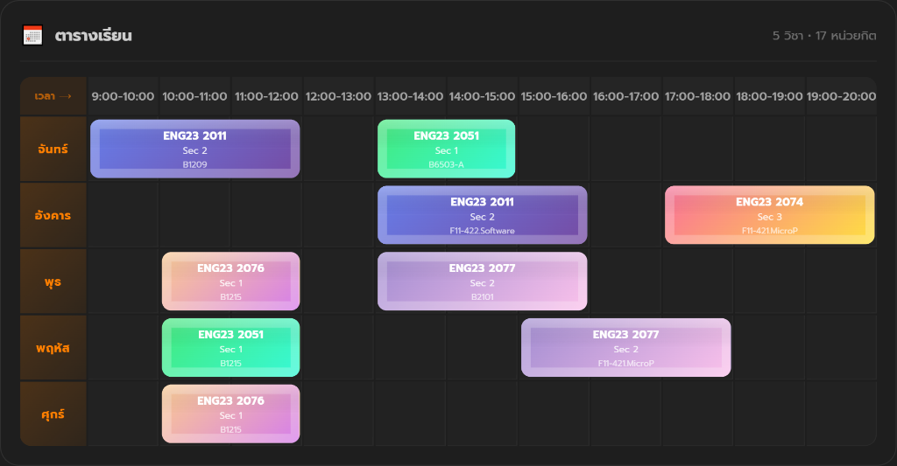

<p align="center">
  
  
  
  
  
</p>

# 📅 Planer by Yom1nr — MySchedule

> **ระบบจัดตารางเรียนอัจฉริยะสำหรับนักศึกษามหาวิทยาลัย**
> ค้นหารายวิชา · ตรวจสอบเวลาชน · จัดตาราง · Export เป็นรูปภาพ — ทุกอย่างจบในหน้าเดียว

🔗 **Production:** [myscheduleapi.onrender.com](https://myscheduleapi.onrender.com)

<p align="center">
  
</p>

---

## 📑 Table of Contents

- [Overview](#-overview)
- [Key Features](#-key-features)
- [System Architecture](#-system-architecture)
- [Tech Stack](#-tech-stack)
- [Project Structure](#-project-structure)
- [Database Schema](#-database-schema)
- [API Endpoints](#-api-endpoints)
- [Getting Started](#-getting-started)
- [Data Pipeline](#-data-pipeline)
- [Security](#-security)
- [Contributing](#-contributing)

---

## 🎯 Overview

**MySchedule** เป็น Full-Stack Web Application สำหรับจัดตารางเรียนของนักศึกษามหาวิทยาลัย พัฒนาภายใต้แนวคิด **"One-Page Planner"** ที่รวมทุกขั้นตอนตั้งแต่การค้นหา เลือกรายวิชา ตรวจสอบเวลาชน ไปจนถึง Export ตารางเป็นภาพ — ทั้งหมดอยู่ในหน้าเดียว ไม่ต้องเปลี่ยนหน้า

### 🧠 Design Philosophy

| หลักการ | รายละเอียด |
|---------|-----------|
| **Single Page Experience** | ทุก Flow อยู่ในหน้าเดียว ลดขั้นตอนการใช้งาน |
| **Conflict-First UX** | ระบบเตือนเวลาชนทันทีก่อนเพิ่มวิชา ป้องกัน human error |
| **Responsive-First** | ออกแบบ UI แยกสำหรับ Desktop (Grid) และ Mobile (Card List) |
| **Persistent State** | ข้อมูลถูก sync กับ server แบบ real-time ทุกครั้งที่มีการเปลี่ยนแปลง |

---

## ✨ Key Features

### 🔐 Authentication System
- **Register / Login** ผ่าน Modal UI พร้อม Loading indicator
- Password hashing ด้วย **bcryptjs** (salt rounds = 10)
- Session management ด้วย **JWT** (1 ชั่วโมง expiry)
- **Persistent Login** — จำ session ไว้แม้ปิดแล้วเปิดใหม่ผ่าน localStorage

### 📚 Course Management
- รองรับข้อมูลรายวิชา **1,000+ รายการ** จาก MongoDB
- **Real-time Search** ค้นได้ทั้งรหัสวิชาและชื่อวิชา
- เรียงลำดับอัตโนมัติ ตามรหัสวิชา → วัน/เวลา → ชื่อห้อง
- แสดงหมายเลข Section อัตโนมัติตามลำดับในฐานข้อมูล

### 🕐 Smart Conflict Detection
- ตรวจจับ **เวลาชนซ้อนทับ** แบบ interval overlap ก่อนเพิ่มวิชาทุกครั้ง
- รองรับวิชาที่มี **หลายช่วงเวลา** ในสัปดาห์เดียวกัน
- แสดงรายละเอียดว่าชนกับวิชาอะไร วันไหน เวลาไหน
- **จำกัดหน่วยกิตสูงสุด 22 หน่วยกิต** ป้องกันลงเกิน

### 📊 Schedule Visualization
- **Desktop:** Interactive Grid แบบ Day × Time พร้อม color-coded blocks
- **Mobile:** Card Layout เรียงตามวัน พร้อมแสดงเวลาและห้องเรียน
- Grid ปรับขนาดอัตโนมัติตามช่วงเวลาที่เลือก (dynamic min/max hours)

### 📸 Export to Image
- **Capture ตารางเป็น PNG** ด้วย `html2canvas` (2x scale)
- ดาวน์โหลดอัตโนมัติพร้อมชื่อไฟล์ `schedule_{username}.png`
- รองรับการ Capture ทั้ง Dark Mode และ Light Mode

### 🌗 Theme System
- **Dark / Light Mode** สลับได้ตลอดเวลา
- จำค่า Theme ไว้ใน localStorage
- UI ปรับสีทั้ง Grid, Background, Text ตาม Theme

---

## 🏗 System Architecture

```
┌─────────────────────────────────────────────────────────┐
│                      CLIENT (Browser)                   │
│                                                         │
│  ┌──────────┐  ┌──────────────┐  ┌──────────────────┐  │
│  │LoginModal│  │   App.jsx    │  │  ScheduleGrid    │  │
│  │  (.jsx)  │  │ (Main Logic) │  │  (.jsx)          │  │
│  └────┬─────┘  └──────┬───────┘  └────────┬─────────┘  │
│       │               │                   │             │
│       └───────┬───────┴───────────────────┘             │
│               │                                         │
│         ┌─────┴──────┐                                  │
│         │  utils.js  │ ← Conflict Detection + Themes    │
│         └────────────┘                                  │
└──────────────────────────┬──────────────────────────────┘
                           │ REST API (fetch)
                           ▼
┌──────────────────────────────────────────────────────────┐
│                   SERVER (Express.js)                    │
│                                                         │
│  ┌──────────────────────────────────────────────────┐   │
│  │  server.js                                       │   │
│  │  ├─ GET  /api/courses        → ดึงรายวิชาทั้งหมด │   │
│  │  ├─ POST /api/register       → สมัครสมาชิก       │   │
│  │  ├─ POST /api/login          → เข้าสู่ระบบ       │   │
│  │  └─ POST /api/save-schedule  → บันทึกตาราง       │   │
│  └──────────────────────────────────────────────────┘   │
└──────────────────────────┬──────────────────────────────┘
                           │ Mongoose ODM
                           ▼
┌──────────────────────────────────────────────────────────┐
│              MongoDB Atlas (Cloud Database)              │
│                                                         │
│  ┌──────────────┐      ┌──────────────────────────┐     │
│  │  courses     │      │  users                   │     │
│  │  ├ code      │      │  ├ username (unique)     │     │
│  │  ├ name      │      │  ├ password (hashed)     │     │
│  │  ├ credit    │      │  └ mySchedule [ ]        │     │
│  │  └ time      │      │                          │     │
│  └──────────────┘      └──────────────────────────┘     │
└──────────────────────────────────────────────────────────┘
```

---

## 🛠 Tech Stack

### Frontend
| Technology | Version | Purpose |
|-----------|---------|---------|
| React | 19.2 | UI Library (Hooks-based) |
| Vite | 7.2 | Build Tool & Dev Server |
| html2canvas | 1.4 | Schedule-to-Image Export |
| SweetAlert2 | 11.x | Premium Alert Dialogs |
| React Icons | 5.5 | Icon Library (FontAwesome) |
| React Hot Toast | 2.6 | Toast Notifications |

### Backend
| Technology | Version | Purpose |
|-----------|---------|---------|
| Express | 5.2 | HTTP Server & REST API |
| Mongoose | 9.0 | MongoDB ODM |
| bcryptjs | 3.0 | Password Hashing |
| jsonwebtoken | 9.0 | JWT Auth Tokens |
| cors | 2.8 | Cross-Origin Resource Sharing |
| dotenv | 17.x | Environment Variables |
| nodemon | 3.1 | Development Hot Reload |

### Infrastructure
| Service | Purpose |
|---------|---------|
| MongoDB Atlas | Cloud Database (Free Tier) |
| Render | Backend API Hosting |
| GitHub | Source Control |

---

## 📁 Project Structure

```
myschedule/
├── backend/
│   ├── models/
│   │   └── Course.js            # Mongoose Schema (alternative)
│   ├── server.js                # 🔥 Main API Server (routes + schemas)
│   ├── seed.js                  # Database seeder (CSV → MongoDB)
│   ├── convert.js               # Data converter (raw_data.txt → JSON)
│   ├── courses.csv              # Source data (CSV format)
│   ├── courses.json             # Converted JSON data
│   ├── raw_data.txt             # Original raw course data
│   └── package.json
│
├── frontend/
│   ├── public/
│   │   └── favicon.svg
│   ├── src/
│   │   ├── components/
│   │   │   ├── LoginModal.jsx   # Auth UI (Login / Register)
│   │   │   └── ScheduleGrid.jsx # Schedule display (Grid + Mobile)
│   │   ├── assets/
│   │   ├── App.jsx              # 🔥 Main Application Component
│   │   ├── App.css              # Global Styles
│   │   ├── utils.js             # Time parser + Conflict checker + Themes
│   │   ├── main.jsx             # React Entry Point
│   │   └── index.css            # Base CSS Reset
│   ├── index.html               # HTML Entry
│   ├── vite.config.js           # Vite Configuration
│   └── package.json
│
└── .github/                     # GitHub Actions / CI
```

---

## 🗃 Database Schema

### Collection: `courses`
| Field | Type | Description |
|-------|------|-------------|
| `code` | String | รหัสวิชา เช่น `523101` |
| `name` | String | ชื่อวิชา |
| `credit` | Number | จำนวนหน่วยกิต |
| `time` | String | วัน-เวลา เช่น `Mo09:00-12:00 Room101` |

### Collection: `users`
| Field | Type | Description |
|-------|------|-------------|
| `username` | String (unique) | ชื่อผู้ใช้ |
| `password` | String | รหัสผ่าน (bcrypt hashed) |
| `mySchedule` | Array | รายวิชาที่เลือก (embedded documents) |

---

## 🔌 API Endpoints

| Method | Endpoint | Auth | Description |
|--------|----------|------|-------------|
| `GET` | `/api/courses` | ❌ | ดึงรายวิชาทั้งหมดจาก Database |
| `POST` | `/api/register` | ❌ | สมัครสมาชิก (`username`, `password`) |
| `POST` | `/api/login` | ❌ | เข้าสู่ระบบ → ได้รับ JWT Token + User Data |
| `POST` | `/api/save-schedule` | ❌ | บันทึกตารางเรียน (`username`, `cart`) |

### Example: Login Response
```json
{
  "token": "eyJhbGciOiJIUzI1NiIs...",
  "user": {
    "id": "665a1b...",
    "username": "student01",
    "mySchedule": [
      { "code": "523101", "name": "Programming I", "credit": 3, "time": "Mo09:00-12:00" }
    ]
  }
}
```

---

## 🚀 Getting Started

### Prerequisites
- **Node.js** ≥ 18.x
- **npm** ≥ 9.x
- **MongoDB Atlas** account (หรือ local MongoDB)

### 1. Clone Repository
```bash
git clone https://github.com/yom1nr/myschedule.git
cd myschedule
```

### 2. Backend Setup
```bash
cd backend
npm install

# แก้ไข MongoDB URI ใน server.js (ถ้าจำเป็น)
node server.js
# ✅ Server running on port 5000
```

### 3. Frontend Setup
```bash
cd frontend
npm install
npm run dev
# ✅ Vite dev server running on http://localhost:5173
```

### 4. Seed Database (Optional)
ถ้าต้องการ import ข้อมูลรายวิชาลง Database:
```bash
cd backend

# Step 1: แปลง raw data → JSON
node convert.js

# Step 2: Import JSON → MongoDB
node seed.js
# 🚛 add data successfully xxxx วิชา!
```

---

## 🔄 Data Pipeline

```
raw_data.txt  ──[convert.js]──►  courses.json  ──[seed.js]──►  MongoDB Atlas
     │                                │                              │
  ข้อมูลดิบ                     JSON ที่สะอาด                 พร้อมใช้งานผ่าน API
  จากมหาวิทยาลัย               (code, name, credit, time)    GET /api/courses
```

**รายละเอียด Pipeline:**
1. **`raw_data.txt`** — ข้อมูลรายวิชาดิบจากมหาวิทยาลัย (CSV-like format)
2. **`convert.js`** — แปลงข้อมูลดิบเป็น `courses.json` ที่มีโครงสร้างชัดเจน
3. **`seed.js`** — อ่าน `courses.csv` แล้ว insert ลง MongoDB (ล้างข้อมูลเก่าก่อน)

---

## 🔒 Security

| หมวด | Implementation |
|------|---------------|
| **Password** | bcryptjs hash (10 salt rounds) — ไม่เก็บ plain text |
| **Authentication** | JWT Token (1 hour expiry) |
| **Session** | Token + User data เก็บใน localStorage |
| **CORS** | เปิดใช้งานผ่าน `cors()` middleware |

> ⚠️ **หมายเหตุสำหรับ Production:** ควรย้าย MongoDB URI และ JWT Secret ไปเก็บใน Environment Variables (.env) แทนการ hardcode ใน source code

---

## 🤝 Contributing

1. **Fork** repository นี้
2. สร้าง **feature branch** (`git checkout -b feature/amazing-feature`)
3. **Commit** การเปลี่ยนแปลง (`git commit -m 'Add amazing feature'`)
4. **Push** ไปที่ branch (`git push origin feature/amazing-feature`)
5. เปิด **Pull Request**

---

<p align="center">
  <b>Built with ❤️ by Yom1nr</b><br/>
  <sub>Planer by Yom1nr — MySchedule Project</sub>
</p>
